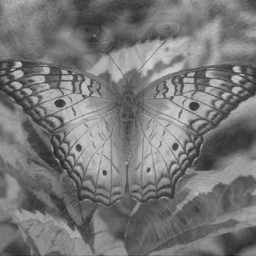

# Image Processing (MC920) - Basic Operations

- [Requirements](papers/enunciado.pdf)
- [Report](papers/entrega.pdf)

This project explores basic image processing operations like mirroring and gamma adjustments, implemented as a simple command-line tool in Python. The emphasis is on getting comfortable with NumPy and OpenCV by writing the transformations directly and applying them through a sequence of commands.

The implemented operations are as follows:

- convert to monochrome
- apply negative
- vertical mirroring
- dynamic range mapping
- reflect even lines
- mirror top half
- gamma correction
- bit plane extraction
- mosaic arrangement
- linear weighted image combination

Below is an example of one such operation.

